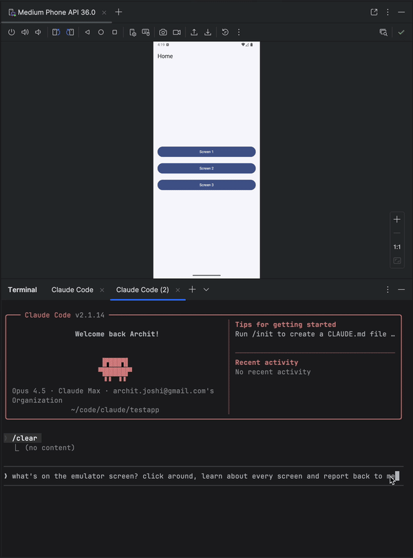

# replicant-mcp

**Let AI build, test, and debug your Android apps.**

[](https://github.com/thecombatwombat/replicant-mcp/actions/workflows/ci.yml)
[](https://nodejs.org/)
[](LICENSE)

replicant-mcp is a [Model Context Protocol](https://modelcontextprotocol.io/) server that gives AI assistants like Claude the ability to interact with your Android development environment. Build APKs, launch emulators, install apps, navigate UIs, and debug crashes—all through natural conversation.

---

## Demo



---

## Why replicant-mcp?

| Without replicant-mcp | With replicant-mcp |
|-----------------------|-------------------|
| "Run `./gradlew assembleDebug`, then `adb install`, then `adb shell am start`..." | "Build and run the app" |
| Copy-paste logcat output, lose context | AI reads filtered logs directly |
| Screenshot → describe UI → guess coordinates | AI sees accessibility tree, taps elements by text |
| 5,000 tokens of raw Gradle output | 50-token summary + details on demand |

---

## Features

| Category | Capabilities |
|----------|-------------|
| **Build & Test** | Build APKs/bundles, run unit and instrumented tests, list modules/variants/tasks, test regression detection with baseline comparison |
| **Emulator** | Create, start, stop, wipe emulators; save/load/delete snapshots |
| **Device Control** | List connected devices, select active device, query device properties |
| **App Management** | Install, uninstall, launch, stop apps; clear app data |
| **Log Analysis** | Filter logcat by package, tag, level, time |
| **UI Automation** | Accessibility-first element finding, spatial proximity search, tap, text input, screenshots |
| **Diagnostics** | Environment health checks via `replicant doctor`; structured logging with configurable level and format |

---

## Coming Soon

- Custom build commands (project-specific overrides, auto-detect gradlew)
- Video capture (start/stop recording, duration-based capture)

---

## Quick Start

### Prerequisites

- **Node.js 18+**
- **Android SDK** with `adb` and `emulator` in your PATH
- An Android project with `gradlew` (for build tools)

```bash
node --version      # Should be 18+
adb --version       # Should show Android Debug Bridge version
emulator -version   # Should show Android emulator version
```

### Installation

```bash
npm install -g replicant-mcp
```

After installation, run the built-in diagnostics to verify your environment:

```bash
replicant doctor
```

### Updating

```bash
npm update -g replicant-mcp
```

---

## Setup

### Claude Desktop

Add to `~/Library/Application Support/Claude/claude_desktop_config.json` (macOS) or `%APPDATA%\Claude\claude_desktop_config.json` (Windows):

```json
{
  "mcpServers": {
    "replicant": {
      "command": "npx",
      "args": ["-y", "replicant-mcp"]
    }
  }
}
```

### Claude Code

```bash
claude mcp add replicant -- npx -y replicant-mcp
```

### Cursor

Add to `~/.cursor/mcp.json` (global) or `.cursor/mcp.json` (project):

```json
{
  "mcpServers": {
    "replicant": {
      "command": "npx",
      "args": ["-y", "replicant-mcp"]
    }
  }
}
```

### Windsurf

Add to `~/.codeium/windsurf/mcp_config.json`:

```json
{
  "mcpServers": {
    "replicant": {
      "command": "npx",
      "args": ["-y", "replicant-mcp"]
    }
  }
}
```

### OpenAI Codex CLI

Add to `~/.codex/config.toml`:

```toml
[mcp_servers.replicant]
command = "npx"
args = ["-y", "replicant-mcp"]
```

Or via CLI:

```bash
codex mcp add replicant -- npx -y replicant-mcp
```

> **Note:** Ensure `adb` and `emulator` are in your PATH, or set `ANDROID_HOME` environment variable. On macOS: `~/Library/Android/sdk`, on Linux: `~/Android/Sdk`.

---

## Example

```
You: "I just changed the checkout flow. Build the app, go through checkout
      with a test product, and make sure the confirmation screen shows up."

Claude: [Builds debug APK, installs on emulator, launches app]
        [Taps "Electronics" category → "Wireless Headphones" → "Add to Cart"]
        [Navigates to cart, taps "Checkout"]
        [Fills shipping form, taps "Place Order"]

        Confirmation screen is showing:
        - Order #38291
        - "Wireless Headphones" × 1
        - Total: $79.99
        - Estimated delivery: Jan 30

        The flow works. Want me to test the edge cases—empty cart,
        invalid address, payment failure?
```

---

## Design

replicant-mcp uses progressive disclosure (summaries first, details on demand) to minimize token usage, and accessibility-first UI automation for faster, cheaper, more reliable interactions than screenshot-based approaches. See [docs/architecture.md](docs/architecture.md) for details.

---

## More Info

- **Configuration:** Set `REPLICANT_CONFIG` for advanced options. See [docs/configuration.md](docs/configuration.md).
- **Logging:** Set `REPLICANT_LOG_LEVEL` (`error`, `warn`, `info`, `debug`) and `REPLICANT_LOG_FORMAT` (`json` for structured output) to control server logging. Logs are written to stderr.
- **Troubleshooting:** Common issues and solutions in [docs/troubleshooting.md](docs/troubleshooting.md).
- **Tool documentation:** Ask Claude to call `rtfm` with a category like "build", "adb", "emulator", or "ui".

---

## Documentation

| Document | Description |
|----------|-------------|
| [Architecture](docs/architecture.md) | Design overview and progressive disclosure pattern |
| [Configuration](docs/configuration.md) | Config file reference, environment variables, Gradle setup |
| [API Stability](docs/api-stability.md) | Tool API versioning policy and deprecation process |
| [Security Model](docs/security.md) | adb-shell safety model, command denylist, threat boundaries |
| [Support Matrix](docs/support-matrix.md) | Tested OS, Node.js, Android SDK, and emulator versions |
| [Known Limitations](docs/known-limitations.md) | Accessibility gaps, timeouts, single-device focus, and more |
| [Artifacts](docs/artifacts.md) | `.replicant/` directory contents and privacy considerations |
| [Troubleshooting](docs/troubleshooting.md) | Common issues and solutions |
| [Changelog](CHANGELOG.md) | Version history |
| [Security Policy](SECURITY.md) | Vulnerability reporting process |
| [Support / Getting Help](SUPPORT.md) | How to report bugs and ask questions |
| [Contributing](CONTRIBUTING.md) | Development setup and guidelines |

---

## Contributing

See [CONTRIBUTING.md](CONTRIBUTING.md) for development setup and guidelines.

---

## Acknowledgments

- Inspired by [xc-mcp](https://github.com/conorluddy/xc-mcp) for iOS
- Built on the [Model Context Protocol](https://modelcontextprotocol.io/)

---

## License

[MIT](LICENSE)

---

**Questions?** [Open an issue](https://github.com/thecombatwombat/replicant-mcp/issues)
